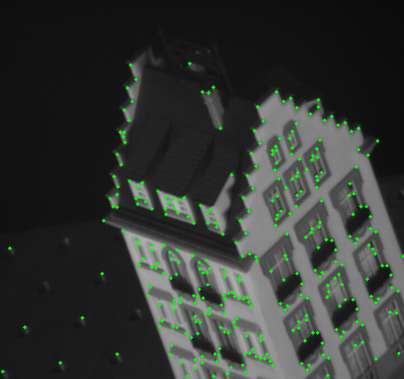
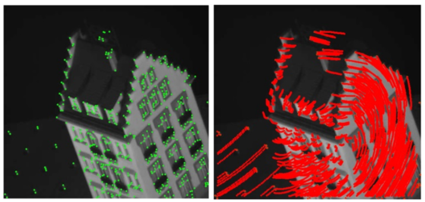

# Feature-detection-and-tracking
### Contents of Repository:  

* Feature detection Harris corner detection implementation
* Feature tracking - Lucas Kanade feature tracking
* Shape alignment Affine transformation implementation

### 1. Feature detection 

Corner detection             |  
:-------------------------:|
  |  

### 2. Feature tracking - Lucas Kanade feature tracking
Tracked Points            | 
:-------------------------:|
 |

### 3. Shape alignment (Affine transformation)
Shape Alignment                              
 

 

